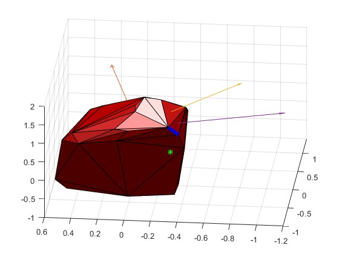
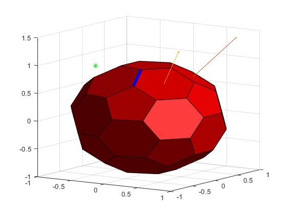

# find-horizon-3d
Find the horizon given convex hull 3D and a point - used to create convex hull efficiently

## examples
* red - current convex hull
* arrows - faces discoverd by the algorithm travel
* green dot - the point for which we would like to calculate the horizon 

